# Cursed Crown

## Summary
Cursed Crown is a classic top-down roguelike dungeon crawler where you play as a soldier trapped in a seemingly endless haunted fortress on a quest to retrieve the mysterious royal crown. Explore the rooms of the dungeon floor cutting through skeletons and vampires, collecting coins to buy damage, health, and stamina upgrades at altars. Master the three combat attacks in your arsenal and make your way through your enemies and power up before facing the final boss. Defeat the boss, the crown's current bearer, or die and be sent back to the start.

## Project Resources

[Web-playable version](https://moesterer.itch.io/cursed-crown)
[Proposal](https://docs.google.com/document/d/1v7Ztfo5egws3jY5RqUr8fIXjQZbynqJY_c1s5bQNXek/edit?tab=t.0#heading=h.i3tv2mxf7h7z)

## Gameplay Explanation

Cursed Crown follows the same structure as many other Rougelike style games where you spawn into the floor, explore the structure of the floor and find the boss all while collecting upgrades/currency to spend on upgrades.

The tutorial already goes through the basic button mappings which are:

- WASD for basic character movement up/left/down/right respectively.
- Shift is a dash move that blinks your character forward a certain distance, while giving the player invincibility frames, this costs stamina but it best used when you are about to be hit with an attack allowing you to dodge damage.
- J is your basic attack, a sword slash. This costs the least amount of stamina out of all your attacks and is your bread and butter, does a good amount of damage with little knockback allowing you to defeat enemies
- K is a shockwave attack, doing a smaller amount of damage but costing a lot of stamina, it is best used when swarmed with enemies, allowing you to knock them back and give yourself time to escape or fight back
- L is a ranged attack, shooting an arrow in the direction the player is moving. This move costs a good amount of stamina and is hard to hit, making it best for the boss especially when he is standing still.
- F is your interact button allowing you to interact with the altars and chests
- Spacebar allows you to skip the sign dialogue in the tutorial

The META:
The most effective tactic available to beat the game is as follows:

- The skeletons are the most basic and weak enemy. Use your basic sword attack to take them out in 2 to 3 hits
- The vampires will do a lot of damage to you if you arent careful with your movement, it is best to take them out as fast as possible, ideally before the skeletons in the room, allowing you an easier time clearing the rest of the room
- Explore the entire floor before going to fight the boss, which will allow you to get all the coins possible and get full health and hopefully some stamina and damage upgrades for the boss
- For the boss fight, focus on hitting it with arrows when it is standing still. If you get too close with a melee attack it can catch you off guard with a fast attack. When it starts attack with lasers, just focus on dodging the attacks until it stops, to which you will start attacking wiht arrows again. Follow this pattern until defeated

# External Code, Ideas, and Structure

We decided to include these sections in our individual contributions sections for better clarity and distribution.

# Team Member Contributions

## Jonah Ross - Github: jonahkeeganross

### Main Role: Level and World Designer

Designed both the tutorial and main level, using the assets added by Madelaine.

Made the tutorial with the intention off introducing a mechanic, and then allowing the player to have a chance to test out said mecahnics, before introducing the next one, where they then could test everything out at the end of the level on a simple enemy that proves to be a small test for the player to understand the mechanics of the game. Finally it ensures that the player can't leave the tutorial until they have opened the shop system and understand what they can upgrade, giving them an idea of what they should save up for/if they want to save up for anything.

- [Link to tutorial flow chart](https://github.com/jonahkeeganross/ECS179Project/blob/1059c716e308b9f3947ef38fcf8b0d590bbfffbb/Documentation_Charts/Tutorial_Flow_Diagram.pdf): This flow chart was the basic idea behind the tutorial flow, and guided the level design of having the rivers be the separation between the different segments of the players learning, allowing for a smooth, natural separation between the small lessons
- [Link to tutorial design structure](https://github.com/jonahkeeganross/ECS179Project/blob/1059c716e308b9f3947ef38fcf8b0d590bbfffbb/Documentation_Charts/Tutorial_Design_Structure.png): This shows the structure for the tutorial level tilemap. This one was pretty complex because it was a super complex tile map. Each layer had to be its own because many tiles were only half tiles and had to be layered on top of each other to give it the fluid look that it ended up with. Whereas the main level tile map everything was a 16x16 px tile.

As for the main level. The idea was to give the player three different branchs of the level to explore before finding the boss. Roguelike games in particular aren't really supposed to have an increased difficulty in the floor/level themselves, more it should increase as the floors go on, however we weren't able to make more than one solid floor so this wasn't possible to increase the difficulty. To combat this, my idea was to have at least 1 harder room per branch of the floor to give the player a challenge no matter which way they went. On top of this, the more challenging rooms were made that way by adding more enemies, which in turn give the player more chances to get coins to upgrade themselves meaning the more they challenge themselves, the more it pays off in the long run. Once the branch got cleared the player would then backtrack, and choose another branch to explore. Because the lack of procedural generation (something we plan on implementing if we continue working on the game), the player will more or less understand the floor after one run through, which will give them a better understanding of where they want to go with a certain strategy, whether that be collecting as many coins as possible, or going straight to the boss.

- [Link to main level flow chart](https://github.com/jonahkeeganross/ECS179Project/blob/1059c716e308b9f3947ef38fcf8b0d590bbfffbb/Documentation_Charts/Main%20Level%20Flow%20Chart.pdf): This flow chart gives the basic idea of what the main level does until completion, from the main lobby safe room, to each potential branch, which can either lead to the boss room or back to the lobby if there isnt a boss room, through to the next level if the boss is beaten.
- [Link to main level design structure](https://github.com/jonahkeeganross/ECS179Project/blob/1059c716e308b9f3947ef38fcf8b0d590bbfffbb/Documentation_Charts/Main_Level_Design_Structure.png): This shows the structure for the main level tilemap. This one was pretty simple because it wasn't a super complex tile map, allowing for one map as the base walls and structure, and the second layer for the decorations like torches.

Overall I think that the floor design was pretty simple for this game seeing as there is only 1 floor. If more floors were implemented, it would have been more difficult ensuring that difficulty was increased as time went on, but that would also rely on strengthening enemies. I think the basic idea behind each floor was to make it almost maze like, where if you get lucky and find the boss room fast, you can go straight in and skip a lot of fighting, but you also may get really unlucky and have to keep fighting until you dont have enough health to take on the boss, or you may find the boss room and decide to fight everything else to level up before coming back. The level doesn't really decide the strategy, the player does and I think that is the beauty of this style of game.

My main scripting work was on the level controller which utilized a lot of area2d triggers and collision objects to ensure that players were fighting in rooms undisturbed and were locked in when needing to be. Making sure that enemies triggered and turned on when the player entered and not before. Making sure that enemies spawned. Making sure each room had its own designation. I also scripted the enemies movement (will talk about below) which entailed using the NavigationRegion2D and NavigationAgent2D nodes which also needed to be correctly implemented into the level. Implementing the chest and door scenes into the level while also building out the scenes to make sure they open when needed. The scripts are linked below:

- [Level Controller](https://github.com/jonahkeeganross/ECS179Project/blob/ac16c4c707ecaef25aeb805c9da923355c6306de/cursed-crown/Scripts/RoomController.gd#L1)
- [Level Controller (outdated)](<https://github.com/jonahkeeganross/ECS179Project/blob/ac16c4c707ecaef25aeb805c9da923355c6306de/cursed-crown/Scripts/RoomController(outdated).gd#L1>): This script was the inital model that I used to script a basic testing level which included 2 rooms and 1 enemy, which was perfect for learning how to use the navigationregion2d nodes and to make sure that all the nodes triggered when necessary. I realized that pretty much all exports were useless and I made it way more readable but implementeing enemy factories and using lots of groups to be able to find all objects in certain groups without having to call them at the beginning of the script. This was important because it made this script modular and work for every level, instead of my initial plan which was making a script for each level that exported everything that I needed specific to that level.
- [Room Script](https://github.com/jonahkeeganross/ECS179Project/blob/ac16c4c707ecaef25aeb805c9da923355c6306de/cursed-crown/Scripts/Room.gd#L1)
- [Skeleton Script](https://github.com/jonahkeeganross/ECS179Project/blob/ac16c4c707ecaef25aeb805c9da923355c6306de/cursed-crown/Scripts/skeleton.gd#L124): Implemented some of the navigation stuff here, but most scripting for this were done by Alex
- [Vampire Script](https://github.com/jonahkeeganross/ECS179Project/blob/ac16c4c707ecaef25aeb805c9da923355c6306de/cursed-crown/Scripts/vampire.gd#L86): Same here, implemented the movement stuff, but most scripting was done by Alex for other stuff.
- [Door Script](https://github.com/jonahkeeganross/ECS179Project/blob/ac16c4c707ecaef25aeb805c9da923355c6306de/cursed-crown/Scripts/door.gd#L1)

### Sub-Role: Player Onboarding and Tutorial Design

Initially I took on the gameplay testing sub role, but due to the fact that we didn't have a full game until a few days before the presentation I decided to switch my sub-role to tutorial design because I actually ended up designing pretty much the entire tutorial myself. This tied in well with my main role as I initially started by making the level structure, which revoled completely around making the level easy to navigate and structurally lead the player through the tutorial. This lead directly into the implementation of the tutorial flow design

= [Link to Tutorial Design Flow Chart](https://github.com/jonahkeeganross/ECS179Project/blob/1059c716e308b9f3947ef38fcf8b0d590bbfffbb/Documentation_Charts/Tutorial_Flow_Diagram.pdf): This is the same doc that I used to show the flow of the tutorial, it went hand it hand with the design of the level.

The move description assets were built by our asset manager and implemented when hitting the signs. The sign controllers were scripted by Leo but I implemented them into the level with area2d triggers. Scripted the level to make it impossible to leave until all aspects of the tutorial were completed (defeating the skeleton and checking out the altar)

### Other Contributions

Worked on building a coin and coin factory scene which included animation of the coin, spawning and logic of the coin as well as printing out the current coin count at the top of the screen.

- [Script for coin](https://github.com/jonahkeeganross/ECS179Project/blob/1059c716e308b9f3947ef38fcf8b0d590bbfffbb/cursed-crown/Scripts/coin.gd)
- [Script for coin factory](https://github.com/jonahkeeganross/ECS179Project/blob/ac16c4c707ecaef25aeb805c9da923355c6306de/cursed-crown/Scripts/coin_factory.gd#L1)
- [Coin Spawning logic off enemies](https://github.com/jonahkeeganross/ECS179Project/blob/1059c716e308b9f3947ef38fcf8b0d590bbfffbb/cursed-crown/Scripts/skeleton.gd#L193): This is the same in both the vampire and skeleton scripts
- [Coin Spawning logic from chests](https://github.com/jonahkeeganross/ECS179Project/blob/ac16c4c707ecaef25aeb805c9da923355c6306de/cursed-crown/Scripts/chest.gd#L1)

Alterred the camera to fit the tutorial with a bit more restriction, nothing crazy just removed horizontal player tracking and limited the camera to stop at the top and bottom boundaries of the level to make it flow with the tutorial

- [Tutorial Camera Logic](https://github.com/jonahkeeganross/ECS179Project/blob/ac16c4c707ecaef25aeb805c9da923355c6306de/cursed-crown/Scripts/tutorialCameraController.gd#L24)

---

## Alexandr Volkov
### Main Roles: Game Logic

Designed all systems and wired together different components to ensure they worked well. Made the original plans for how the game should be structured as well as finite state machines used in different components. Also took in the role of producer as we didn't have one. 

 This Role started off with me making a very simple diagram for how the game should be. I made a lot of them in lucidchart to visually comprehend the interconnectedness. Once this was done, I created core assets of the game so that the rest of my team could start contributing. I used a lot of the mechanics from the first exercise as well as organization because I felt that our game has resembling componetns and it would be a good starting point. In my documentation I will provide the original plans, the final plans with changes, and finally the finite state machines that I used. 
 
---

#### **In the following section I will walk through the original plan that we had. WE DID NOT GO WITH THIS PLAN IN THE END, BUT THIS WAS PART OF MY DESIGN PROCESS** 

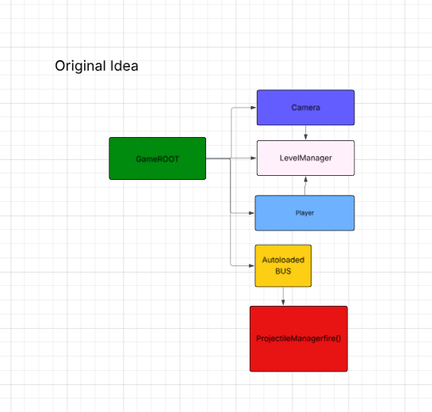

This diagram was the ideal plan. I was hoping that this would be the organization because I felt that having a common game root that wired together the Camera, Player, BUS and Levels would be the best system. When a player loads into the game, the root would load the player and pass in a reference into the level manager as well as the camera. 
To simplify things, I figured I would add a bus so that weirdly wired components would be able to communicate amongst each other. It has helped me in past games I've made so I figured it wouldn't be a bad idea. 

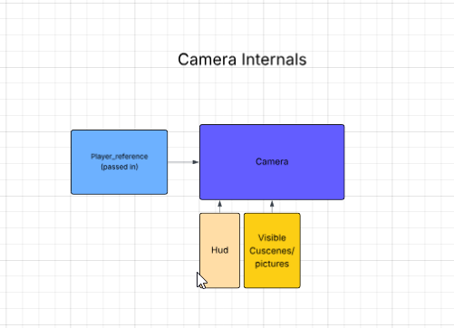

This section shows how the camera would be wired. I planned to have the player passed into the camera, but also have the camera be its own component and independent from the player and the levels. This way cuscene animations could be added and the camera wouldn't need to recenter when switching levels. 

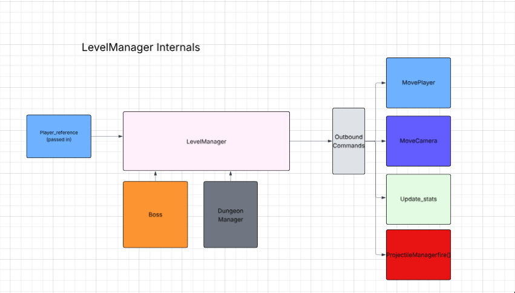

The level manager would be the actual scene that loads in. I was planning on passing in all the important parts such as player, camera, bus information and the projectile manager so that upon loading, the level would be able to connect and reference information of all of those parts. In particular I was thinking that the level manager would need to get the player position for figuring out what room they are in.

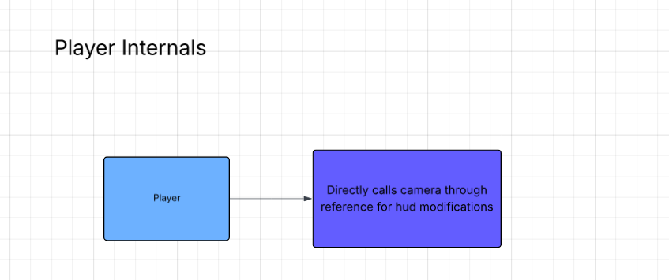

This image doesn't require a lot of explaining. I simply wanted the player to be able to call the camera directly or through calls wired through the game root to update the hud details such as health or stamina. 

---
#### **This section goes over the final design** 

For the final design we ended up changing a lot from the original plans. This was due to time constraints and misscommunications, but it ended up working out in the end. I believe the original plans are better for modularity, and for more complicated systems but our current organization works for only having a tutorial and one level. 

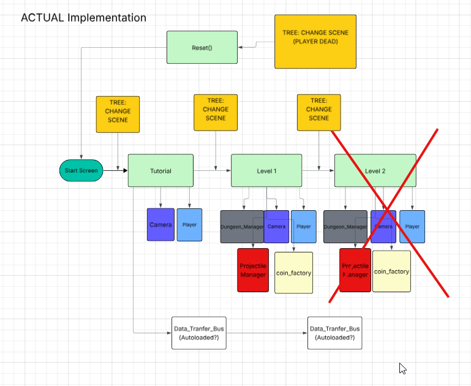

This image shows the full design. Rather than having a main tree that wires all the components, we ended up going with a per level wiring. The idea is the same, but there needs to be a player per level-scene as well as a pre-level camera. Switching levels is as easy as looking at the tree and switching the scene to the corresponding level, but has shortcomings. I implemented a BUS that wires all the parts that might be referenced deep within the project to make it easier so that we wouldn't have to propogate references, but I actually think this was poor design on my behalf. This should have also been done through signals per level rather than a BUS. In reguards to this point, this is one of the complications that came with switching the full tree as data would not be tranferrable.  For the sake of gameplay mechanics and delivering a finished product we went with this, but if we had more time I think we would need to reorganize so that the levels would be separate from players. Final note, we originally planned for a second level, but that was not included because of time constraints. 

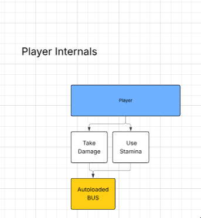

This diagram shows the simple interactive components of player. The player only needed to reference the camera in order to convey damage was taken or stamina was used. The rest of the player interactions will be indicated in the FSM secion. 

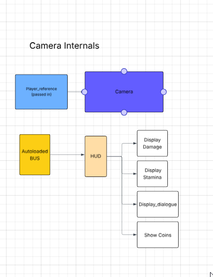

Our camera implementation was pretty similar to the original plan. The only difference was that I used a bus to communicate changes in the player info (stamina and health). I should have simply exposed endpoints per level-scene, but it worked out. 

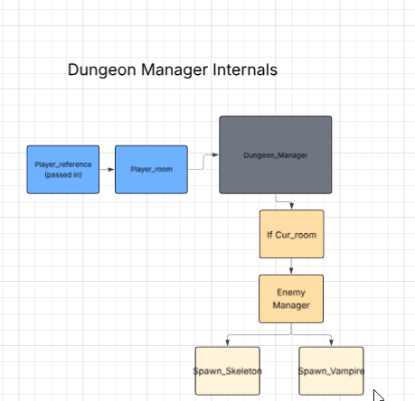

Our dungeonmanager is techincally the main level script, but I visually wanted to seperate it because it had other details and was different in the tutorial as opposed to the first level. When a player would enter a certain room, the dungeon manager would check what room it was and then for that corresponding room activate all the enemies as well as resume their physics processes. 

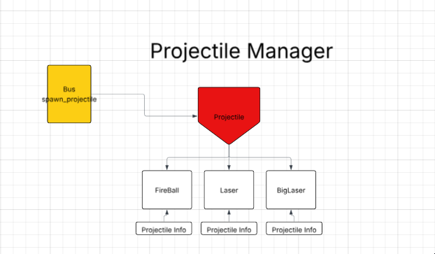

The final big component that that interacted with everything else was the projectile manager. This was the component responsible for shooting projectiles from enemies. I thought this was going to be used for player projectiles as well (so that I could have a common pooling system), but that was beyond our scope. The way it works right now is the BUS exposes endpoints that anybody can call which will spawn projectiles of a certain type. My design was once again lacking because of the reliance on the BUS; It works, but signals should have been managed inside the level. 

Future plans: I believe that for the scope of the project this was not a bad idea. It is however not the proper design for making a game greater that could have multiple levels. Part of this issue is my fault for not strictly enforcing the original format, but as game design I decided that in order to have a working game this aspect can be overlooked. I have learned a fair bit from making this design and believe that in the future I can make a better design.  

#### **This section will go over the different FSM that were used. These show my plans for how players and enemies would attack** 

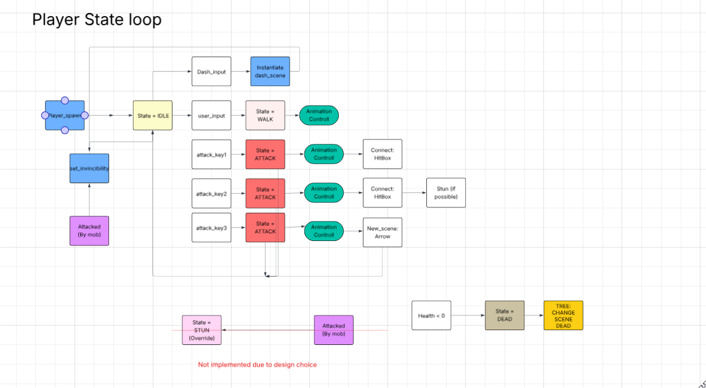

This diagram shows the final design for the player. I will not go too in depth as I believe the diagram explains most of the interactions. It is greatly different from the original especially because we decided to add stuns to enemies as well as i-frames when hit and when dashing. The rest of the design alligns with what was originally planned. I was hoping to add knockback when getting hit by an enemy, but ran out of time for this. 

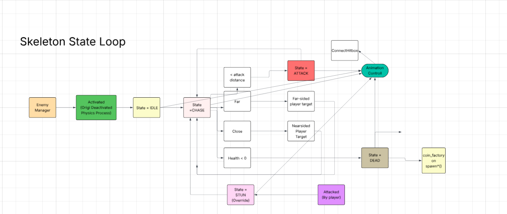

This diagram is the skeleton FSM. Upon activation the skeleton would be able to go through the cycle. It would chase the player until close enough to one of the two sides of the player. I worked on both enemies so I will explain how these work later on in the **other contributions** section. 

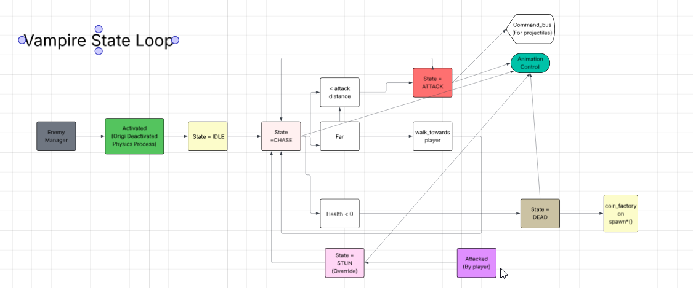

The vampire FSM is very similar to the skeleton one with the key difference being the attack mechanic. Apart from playing the animation it would call projectile manager to spawn a fireball. 

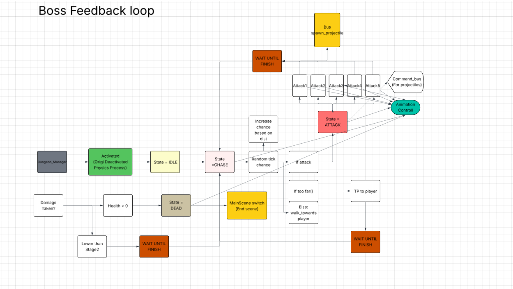

This is the final FSM I want to display. The boss FSM is similar to the other ones, but has a couple more interactions as it is more core to the game. One such interaction is what the boss does when it is dead. The other is the second stage. I will go more in depth in the **other contributions** section.

### Sub-Roles: Performance Optimization

My role as performance optimizer was not the most difficult. A lot of the members contributed assets/code that were not very hard to render and for that reason we did not have lag. I did however do small changes and monitor various aspects throughout. The following graphs will be my analysis on the final product as well as one aspect that I intentionally had to check to make sure the rendering would not be too bad. I analysed the frame time, the memory count, as well as object count of the full game and here is what I found.

#### Frame time
I will mainly refer to the physics frame time of 16.66 ms as this is what defines player movement. If process time or script time were to go beyond this point, the physics process would slow down and have visible effects in the actual game. 

Frame time was not a great issue for us, but my greatest concern was the projectiles because I noticed a lot of them had thier own processes, and had to be spawned in one instance. For such reasons I monitored the different effects of the number of projectiles and the frame rate. 

This first example shows what the upper limit is, and something that we avoided throughout the game. 
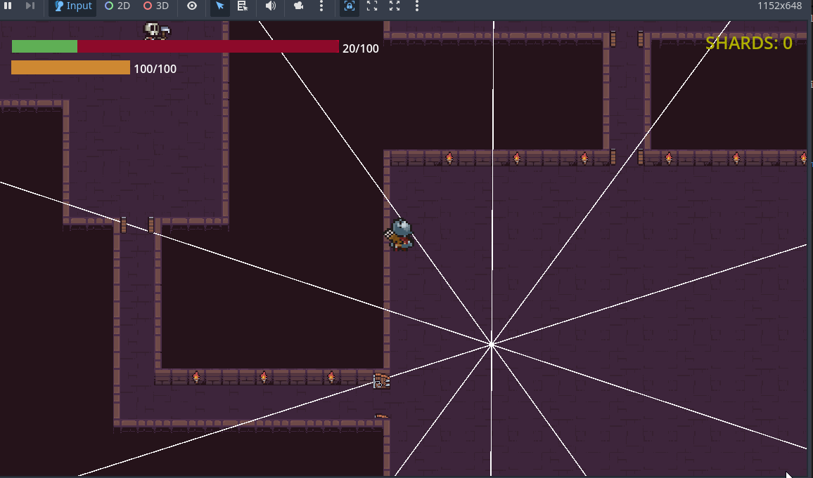
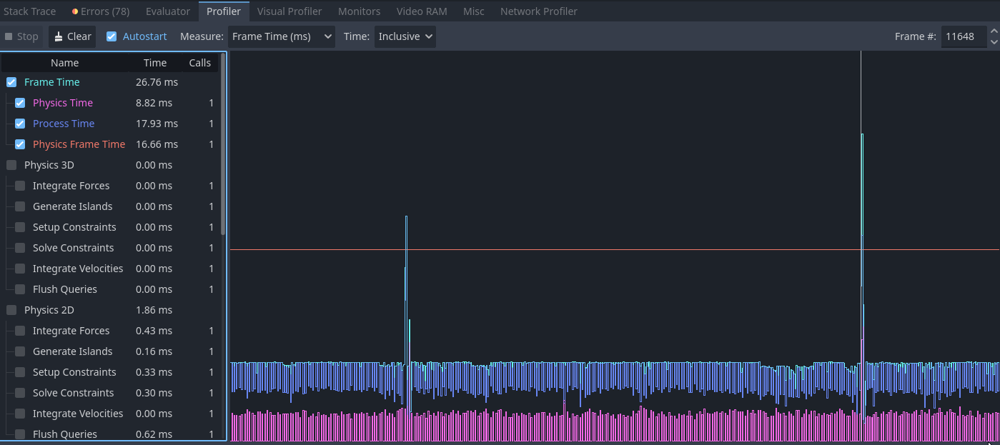

As is shown in these two graphs, spawning 60 lasers (they are on top of each other) would overshoot the physics limit of 16.66 ms and would likely lead to lag. For such reasons we tested other cases and ended up finding that 20 lasers at once is the goldilocks number. Whats to note is that the main spike comes from the actual spawn and it settles afterwards even though there is tweening. This is what it looks like with 20 lasers in the final results:

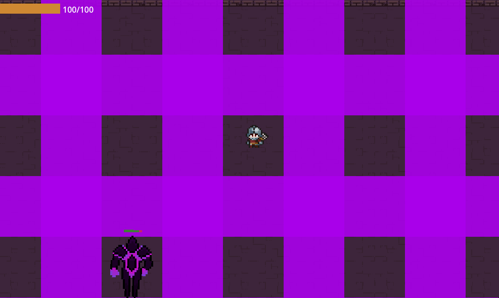
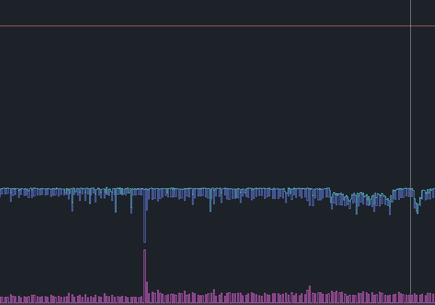

Though not as visible as the previous example, there is a spike when the lasers spawn (Left side of the graph). The spike however does not go over the physics process and is practically invisible to the player. 

Apart from this, There is only one other place where the framerate would drop and that is due to loading into a level. During this particular instance, there would be noticable lag for about a frame or two, and then it settled. This is expected behavior and once again did not ruin the user experience. 

#### Memory Profiling 
The memory profiling was also not an issue. The main thing I was looking for was for memory leaks where objects would not get deleted (in particular projectiles) and could cause the user experience to be ruined. I monitored the memory multiple times as I playtested the game and it averaged about the same amount

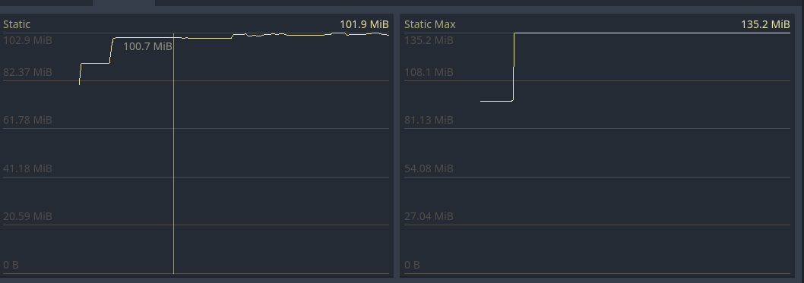
 
The following graph shows the memory through a single run of the game which included opening chests, buying upgrades, killing enemies and fighting the boss. The first significant spike here is the memory increase due to loading into the first level. This is expected as a lot more assets are loaded. The other mini-spike is when fighting enemies as projectiles are spawned. These are however deleted and as is visible, the end memory remains more or less the same. There is a slight increase and that I attribute this to caching, but not an acutal issue as there is no cumulative growth.  

#### Object Count
The final imporant aspect of my role was ensuring that object count was not increasing significantly. As opposed to memory, this section deals with singular objects and having to account for the various processes inside of them. My understanding of object count is that too many of them and the CPU has to keep track of them all meaning that it could result in gameplay-slowdown. 

The following is a graph on the object count. 
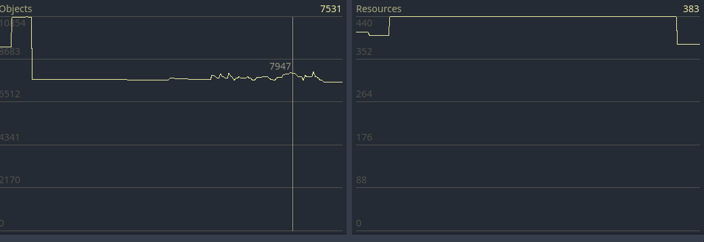

This graph shows the object count of a full run through our game. The first spike indicates the scene loading and is expected. The rest of the time, the object count stabalizes. The only time that it fluctuates is during projectiles spawning, and even still, that is not too much. Since there is no monotonic climb, I concluded that there are no issues with objects and freeing them 

#### Further Contributions And Takeaways
Apart from noting these graphs through our development process, I also did a couple small changes that I believed would speed the game up. One of these was turning off the physics process and the process calls in the enemies before they are activated. I figured that doing so would mean less calls to nodes that aren't functional and a lot better down the line. Upon entering the room, the room is now responsible for that aspect. The rest of the changes were minor, but I made sure to keep an eye out for them. 

If I had more time, I would have attempted to implement object pooling. Rather than rendering a new object every time (specifically the projectiles), It would have helped to render them and then make them invisible for reuse (for a certain amount of time). I would do this if I were to continue working and it wouldn't be that big of a change. The thing is, I made the projectile system ONE system specifically so that these aspects could be monitored for pooling, with performace optimization in mind. 

If there are any takeaways from this role, I believe that this role has really taught me how to manage three important aspects that could slow down games. I plan on continuing making games whether lua, unity, or godot, and for bigger scale projects, this understanding is crucial. 

## Other Contributions
Since we did not have a full team my contributions I had some overlap with what other people did. I will write a short description for each. 

The first aspect I contributed to was the player. I fully designed the player mechanics and the system that would be used. Originally we went with a command system for moving, but that quickly changed as it was easier to have the character controll all those aspects. I did everything for the character apart from the animations and the arrow launching. This includes mapping the damage boxes to the attacks, ensuring that the enemies would be knocked back upon getting hit, making the animation tree, and finally the dash mechanic. The QOL change I added was the player blinking to indicate invincibility. I added this at the end and think it looks pretty well done. 

- [Player script](https://github.com/jonahkeeganross/ECS179Project/blob/main/cursed-crown/Scripts/player.gd)

**For this section I did use a significant portion of the dash effect from a youtube video. I wasn't sure how to do it myself, and for that reason I used it as a starting point, but built off of it. **
- [Referenced dash video!](https://www.youtube.com/watch?v=fp_XugQvOKU)

The next aspect that I made was the camera. There is not much to be said, but the camera mechanics (such as the lerp) was me. 

- [Camera Script](https://github.com/jonahkeeganross/ECS179Project/blob/main/cursed-crown/Scripts/camera_controller.gd)

Part of the camera was the HUD and this was also what I worked on. I first made two simple progress bars that can be referenced by the BUS and then connected them to the player. I am pretty proud of how it turned out especially how the health bar progresses (there are two stacked on top of each other). The other part of the hud was the popup text when interacting with the different characters. It is a simple script that allows any object to pause all physics_ticks for the player while a textbox has text appear letter by letter. 

- [HUD](https://github.com/jonahkeeganross/ECS179Project/blob/main/cursed-crown/Scripts/HUD.gd)
- [Text_Box](https://github.com/jonahkeeganross/ECS179Project/blob/main/cursed-crown/Scripts/dialogue_controller.gd)

Apart from the camera I also was in chararge of the enemy mechanics. I set up the enemy animation trees to accurately represent what the enemies are doing at any given point. I followed the FSM (referecned above) and made it so it has various states that it can switch to. The other important mechanic I worked on was the knockback. I made it so that if the damage_box of the player connected, the enemies would enter a stunned state and get pushed back. They would also have their animation canceled (I though this was pretty sweet). Jonah helped me out with the core pathfinding, but I added the more specific pathfinding for QOL

For skeletons, I made sure that the skeletons target the closest side of the player rather than the player. We didn't have 4-way attacks and this way we would be able to have the skeletons attempt to attack the player. Without this, the skeletons would often position themselves above the player and not be a worthy enemy. 

- [Skeleton Script](https://github.com/jonahkeeganross/ECS179Project/blob/main/cursed-crown/Scripts/skeleton.gd)

For the vampires I didn't have to change much of the mechanics. Jonah implemented the attack/chase sceme, and I tuned it into the FSM so that it felt good with the animations and the overall game. I also connected the animations to my projectile system

- [Vampire Script](https://github.com/jonahkeeganross/ECS179Project/blob/main/cursed-crown/Scripts/vampire.gd)

The projectile system was the other system that I think I implemented relitively well. I made it so that projectiles can have a list of commands and can move in any way shape and form. The code is not the cleanest, but I am proud of what it can do. With this system I was able to spawn lasers after a certain delay, make the lasers change orientation, make fireballs target player, and make fireballs explode out and in. Below I will provide references to both the projectile manager and the different parts 

- [Projectile Manager](https://github.com/jonahkeeganross/ECS179Project/blob/main/cursed-crown/Scripts/DamageManager/projectile_manager.gd)
- [Fireball](https://github.com/jonahkeeganross/ECS179Project/blob/main/cursed-crown/Scripts/DamageManager/Projectiles/fireball.gd)
- [Laser](https://github.com/jonahkeeganross/ECS179Project/blob/main/cursed-crown/Scripts/DamageManager/Projectiles/lazer.gd)
- [BigLaser](https://github.com/jonahkeeganross/ECS179Project/blob/main/cursed-crown/Scripts/DamageManager/Projectiles/biglaser.gd)

Though there are many small changes I made apart from these, the biggest I would have to argue is the boss fight. The full fight was designed and implemented by myself. I was quite limited by the animations simply because we weren't able to get intese animations with the boss. For this reason I made the boss fight very focused on dodging projectiles. I made a bunch of cool patterns that demonstrated the extent of the projectile system. 

To do the boss I started off by creating a FSM and then applying implementing simple movement. The issue with this was that the player was able to kite too easily so I also added teleportation (within gameplay bounds). Every render, the boss calculates a number and depending on the number, the boss takes certain actions.This should have been changed to tick based, but I did not have time. The attacks are completely random but once the boss looses half its health, the chance increases and it becomes invunerable and requires you to kill the minions. I have to admit the code was not the most organized for this part, but it works well and is a fun boss fight. 

- [BossScript](https://github.com/jonahkeeganross/ECS179Project/blob/main/cursed-crown/Scripts/DamageManager/Projectiles/lazer.gd)

**One thing to note was that I used AI to create the image for the shield. AI was not used ANYWHERE else. We were low on time and I wanted a shield like image.**

- [AI USE!](https://github.com/jonahkeeganross/ECS179Project/blob/main/cursed-crown/Assets/boss/bossShield.png)

## Madeleine Oesterer - git username: moesterer
### Main Role: Visuals and Animations

### Asset Credits

#### Player
- **Soldier sprite & Arrow** from [Tiny RPG Character Asset Pack](https://zerie.itch.io/tiny-rpg-character-asset-pack)

#### Tilesets & Dungeon Objects
- **Dungeon tileset & animated objects** (torches, chest, candlestick, flag, trap)  
  from [Dungeon Asset Pack](https://pixel-poem.itch.io/dungeon-assetpuck)
- **Outside tileset** from  
  [Hana Caraka Topdown Tileset](https://otterisk.itch.io/hana-caraka-topdown-tileset)

#### Enemies
- **Vampire & Skeleton sprites** from  
  [Dungeon Asset Pack](https://pixel-poem.itch.io/dungeon-assetpuck)

#### Boss
- **Boss base sprite** from  
  [Animated Final Boss Sprites](https://newastronaut.itch.io/animated-final-boss-sprites)

#### Projectiles
- **Fireball animation** from  
  [Fireball Animation Pack](https://nyknck.itch.io/fireball-animation)

---

### Visual Style
Throughout the game all of my design decisions were guided by a cohesive visual style rooted in a dark medieval dungeon aesthetic that was blended with royal themes. This was gathered after our initial plan and the narrative of our game was thought up as a player cursed to roam the dungeon forever because they are cursed by a crown. Because the game was built using 16x16 pixel art tiles, after the tile set was chosen nothing could be overly large or detailed, instead the visuals rely on simplicity, clarity, with a hint of a nostalgic feel for older pixel art games. The color palette leans heavily into warm but shadowy tones with lots of reddish purples, deep royal purples, and gold accents. Keeping these in mind both unify the environment as well as emphasize the cursed crown narrative motif. This palette fuelled a lot of my original designs, from recoloring and modifying existing animations to creating the gameplay screens. To match the dungeon atmosphere I also wanted any UI elements to echo aged parchment and faded ink. Overall the visual direction embraces the charms of retro pixel art while simultaneously reinforcing the games’ royal dark fantasy identity.

---

## Player Animations & Additions
To save time I found most of our base assets on itch.io as seen linked above.

However in order to make the game more cohesive and feel more professional, a lot of the assets needed modifications or extra animations that weren't given through itch.io.

I started with the player. Our game is a top-down point of view, and this soldier asset that we are using for the player is built for platform games, so it lacked animations for all four cardinal directions. When facing left or right it's simple to just flip the existing animation, however I used the art app procreate to create the animations when the player is facing up or down (back or front) for all actions that required 4 directional animations. I created an additional two animations for walk, idle, three attacks (sword slash, sword shockwave, shooting an arrow), and even created a revival animation that used the death animation as a base but added a glowing crown which mysteriously revives the player. This revival animation was not used due to a lack of time and not implementing the corruption system that would have used the revival animation. The second attack, the sword shockwave also did not have the shockwave effect in the original animation so I created three animations for that one action that include the Shockwave of dust which is used to visually identify the knockback effect the player has on enemies. All of the animation sprite sheets shown in the image above work created by me. I then animated them using an animated player in Godot and set the right key frames and fiddled around with the timing so that the animation looked right.

The third attack is the player shooting an arrow, in Godot I created an arrow scene that was linked in the animation player of the corresponding attack so that the arrow would spawn at the right time with the animation. I created the base script for the arrow projectile that moves in a set direction, rotates to face its trajectory, and was later modified by our group member Leo to make sure that the arrow damages any enemy it collides with and deletes itself on impact. I also wrote the code snippets inside the player script _shoot_arrow() and _get_cardinal_direction() that spawn and position the arrow, choosing the direction based on the player's facing or movement and the offset so that it appears at the bow.

## Tilesets and Tile Animations
The tile sets were not modified visually by me, they were two separate tile sets found on itch.io, one for the dungeon and one for the outside tutorial level. The animated objects however came as several sets of separate PNG files which to my knowledge were not compatible with creating animated tile sets to be used throughout the level. I again used procreate to arrange the pngs in the correct format, a horizontal sprite sheet and then added to the project by making the animated tile sets within a separate tile map layer in Godot. This formatting was also used to make it easier to animate objects and in total I configured: the torches (side and front), chest, candlestick, flag, coins, and a trap (which we did not end up using).

## Enemies
The enemies, vampire and skeletons rights were found on itch.io. When searching for enemies I took into account art style as well as color to make sure these monsters were something I could see inhabiting the level, aka they didn't look out of place. After configuring them and animating them in godot I resized them to be relative to the player.
Later it was decided we wanted one of the enemies to have a projectile attack, however it was difficult finding an enemy on itch.io that had a projectile attack while also matching our visual style, so I found a fireball animation that could be added on to the vampire's existing attack (which was originally a bite) to make it look like the vampire was breathing a fireball at the player. The fireball scene was already created. I just added the animated sprite 2d.

## Boss Modifications & Additions
The boss assets are also from itch.io, I chose this asset because it had several attack animations and seemed to have four cardinal direction animations. Once I downloaded the asset I noticed this wasn't quite true, as only the walking animation seemed to have 4 directions. However, since our boss does not heavily rely on the animation to deal damage, but rather as an indicator for other projectiles being created with code, it ended up working out. The main thing I modified with the boss was the color palette. It was very clear that the original sprite animation color palette did not suit our visual style which included a lot of purples and gold and a darker dungeon aesthetic. I wanted to continue this visual language so for all the existing animations I modified the color palette to go from a light sci-fi blue glow to a mystical purple magic that better suited our needs. I also modified some of the animations to suit our vague narrative of the soldier being cursed by the boss. The cursed item used to inflict the curse upon the player is a crown. If you look carefully at the second row within the image, you can see a vague crown-like shape when it is spawning compared to the original right above it. I also created an original death animation for the boss, as the asset downloaded from itch.io did not have one. Again I animated the boss using an animated player, and created an animation tree with conditionals from one animation to the next as seen here.

## Small Original Additions
I created two small assets that are used throughout the game. I created the altar sprite, which is used to upgrade the player. I also designed the crown and created the scene and script in crown and the lines in boss that drop the crown as the boss’ position once the player has defeated the boss.

## Tutorial Popups and UI
On the tutorial stage, in order to get the player familiar with the game mechanics I created several tutorial pop-up screens in procreate. I also created the script within the tutorialPopup scene That controls the UI essentially and temporarily locks player input while the instructional pop-up is displayed. It also queues up the tutorial textures and shows them one at a time and automatically sizes them to fill the screen, advancing to the next image whenever the player presses any key. When the queue is empty it hides itself and unlocks the player again. In the RoomController script of the tutorial I added the relevant lines to use and call the tutorial pop-up screens. This includes the declaration reference to the pop-up, the pop-up instance, and the helper function that triggers the first tutorial screen.

The order is shown in the image here. Upon first entering the tutorial scene the first pop up is the walking and dash mechanics, The player can then walk all the way to a sign that they can encounter in the level to receive the next three instructions about the types of attacks, and then finally at the altar they can receive the interact instructions for how to deal with altars and chests.

Speaking of visual style, because this is a medieval inspired game I stuck with that aesthetic and created a scroll like background for the instructions and then used a dynamic frame from the corresponding animations, recoloring them to look like old ink on paper that's faded to brown and positioning them along with brown text explanations.

## Gameplay Screens and Scene Flow
Because our group lacks a User interface and Input Role, all of the screens I designed were created in the hopes of being easy to implement. I implemented the main scene changes in the godot scripts. They lack buttons but rather if they need user input, I stuck with ‘press any key to ‘blank’’. In procreate again I designed the start screen, and screen, and windscreen which are implemented as individual control-based scenes that all contain their own Logic for handling input or timed fades. I again implemented the script for all of these scenes. The start screen listens for any key or mouse press and then immediately loads the next gameplay scene which is TutorialOutdoors. I also implemented the logic for going to the end screen which reads ‘game over’ upon the player’s death and the Win Screen that shows when the boss is defeated and has dropped the crown. Both the end screen and the wind screen fade to black using a timed fade tween_property on a ColorRect Before changing the scene to return to the start screen. Essentially I created a loop with basic key press as user input due to lacking someone for the official role.

---

### Sub-Role: Audio

### Audio Credits

#### Background Music
- **BGM** from  
  [8-Bit Fantasy Adventure Music Pack](https://xdeviruchi.itch.io/8-bit-fantasy-adventure-music-pack)

#### Sound Effects
- **Player and Skeleton/Vampire attack sounds** from  
  [ZapSplat](https://www.zapsplat.com/)  
  *(Some effects edited/shortened by me.)*

---

The background music came from a single itch.io source. the 8-Bit fantasy music pack embodied the pixelated visuals with a slightly older game design and feel. There were several more songs however I chose to use just three of them. One for the start screen, one for the tutorial, and one for the main floor dungeon. Each scene had their own audio stream player with the music configured in Godot to autoplay, loop, and adjusted to background level decibels (-16).

I realized that having too many sound effects could actually be detrimental to the feel of a game. If there are too many of them it can feel overwhelming and cluttered. The sound effects all came from zapsplat.com However I edited some of the effects in a simple browser audio editor in order to shorten them and cut out unnecessary parts of the files. The player and the enemies (vampire and skeleton) each have a sound for all of their attacks as well as a sound that plays upon their death. The player has three attacks so three corresponding sounds which I attempted to match to the movement. The sword slash sounds like a sword slash. The shockwave sound is the rumbling from a landslide, a shortened snippet. The arrow was a simple bow twang (shortened for time). The player's death is a simple thump as if the player is falling to the ground. The skeleton also has a swiping sound as it's attacking with some sort of scythe. However, I added a squelching effect to make the sound slightly more visceral as an attack. When the skeleton dies you can hear a cluttering sound as if a pile of bones has fallen (shortened from a longer cluttering sound). The vampire attack sound is a growl that matches up with a snarling fireball being hurled. The vampire death sound is a groan, because this figure is already undead and turns to ash, I wanted it to feel like a whisper. The boss also has a few sounds, one corresponding to its spawning, one for each of the attack animations (a punch, magic swish, disorienting reversal of an audio snippet) and one for its death (a tired echoing roar) that reflect the boss’ demise in a large cavern that is the dungeon room. As there weren't too many sound effects that corresponded to each character, I used a simple audio stream player 2D for each sound and modified the script to include the audio players as onready variables and played them along with the animations.

---

### Outside My Role

Outside of my role,  I've already mentioned a few things that I think would sit outside of a purely animation and visual. I implemented the shooting arrow and cardinal direction logic as mentioned earlier  which goes slightly under game mechanics programming. I also created the tutorial pop up scene logic with a scripted q-based display and input locking. I also wrote interaction logic for the pop-ups and the starscreen so that pressing any key would progress the tutorial. This goes slightly into UI/UX engineering and gameplay flow scripting territory. Building off of that is the scene flow and game Loop. I created the start -> tutorial -> dungeon -> win/lose -> restart loop Logic and scripts for the transitions, input handling, fades, and the flow diagram. 

For behind the scenes work, we didn't have a producer, so many of the small things a producer would normally be in charge of I helped contribute to. I instigated and created a lot of the communication channels and servers we used as a group. I also reached out to the other groups and organized meetups for when to do the project reports. I created the slide that was used in the final presentation. I created and uploaded the web version of our game to itch for the presentation and final version. I also tended to write a lot of the base paragraphs on our progress reports (the one we did on ourselves as well as the other group).

---

